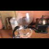
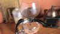
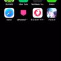

# AWS Elemental MediaConvert でサムネイルを出力する際の設定メモ

## サイズについて

https://docs.aws.amazon.com/mediaconvert/latest/ug/video-scaling.html

サムネイル出力する際に使用するプリセット

```
{
  "VideoDescription": {
    "Width": 100,
    "Height": 100,
    "ScalingBehavior": <スケーリング動作名>,
    "Sharpness": 50,
    "CodecSettings": {
      "Codec": "FRAME_CAPTURE",
      "FrameCaptureSettings": {
        "Quality": 80,
        "MaxCaptures": 1
      }
    }
  },
  "ContainerSettings": {
    "Container": "RAW"
  }
}
```

### 入力動画が横長の場合

> 入力動画のサイズは、1280 × 720

|スケーリング動作名|出力されたサムネイルのサイズ||
|:--|:--|:--|
|DEFAULT|100 x 100||
|STRETCH_TO_OUTPUT|100 x 100||
|FIT|100 x 56||
|FIT_NO_UPSCALE|100 x 56||
|FILL|100 x 100||


### 入力動画が縦長の場合

> 入力動画のサイズは、886 × 1920

|スケーリング動作名|出力されたサムネイルのサイズ||
|:--|:--|:--|
|DEFAULT|100 x 100||
|STRETCH_TO_OUTPUT|100 x 100||
|FIT|46 x 100||
|FIT_NO_UPSCALE|46 x 100||
|FILL|100 x 100||

### FIT と FIT_NO_UPSCALE の比較

- 同じ点
  - ビデオのアスペクト比を維持しながら、異なる解像度を出力する
- 違うこと
  - 出力ビデオの解像度 > 入力ビデオの解像度
    - FIT: 入力ビデオが出力解像度に合わせて拡大
    - FIT_NO_UPSCALE: 拡大も縮小もしない
  - 出力ビデオの解像度 < 入力ビデオの解像度
    - FIT: 拡大も縮小もしない
    - FIT_NO_UPSCALE: 入力ビデオが出力解像度に合わせて縮小